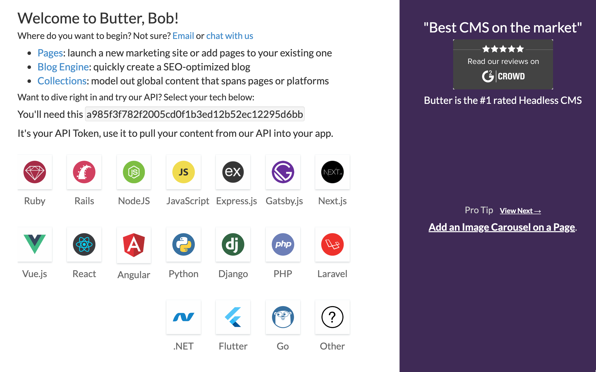
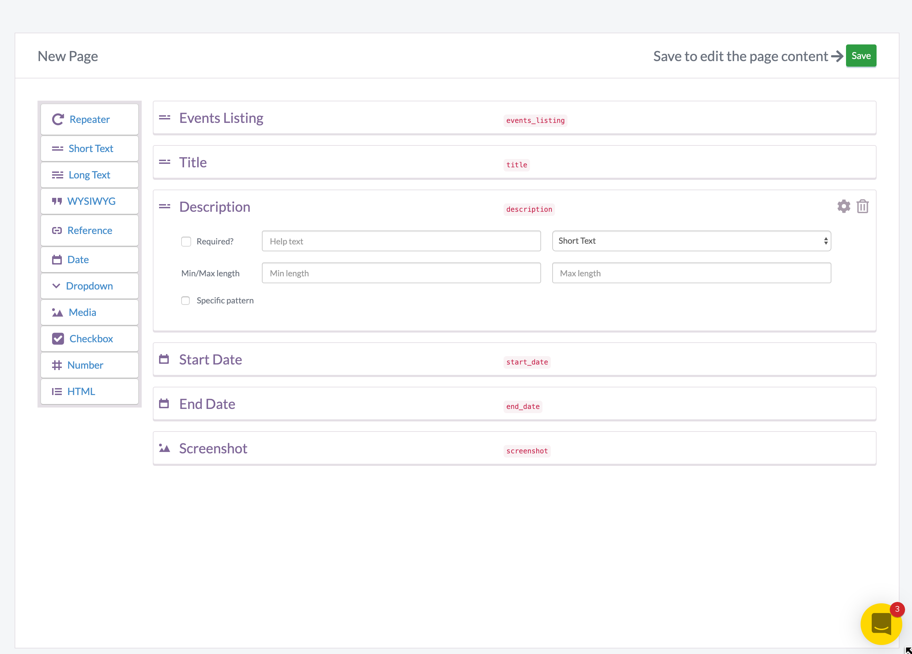
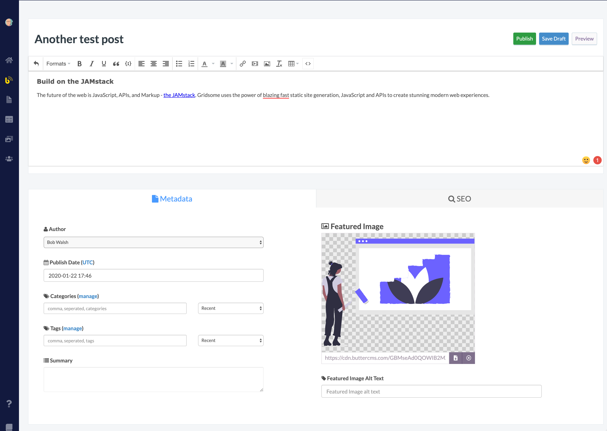
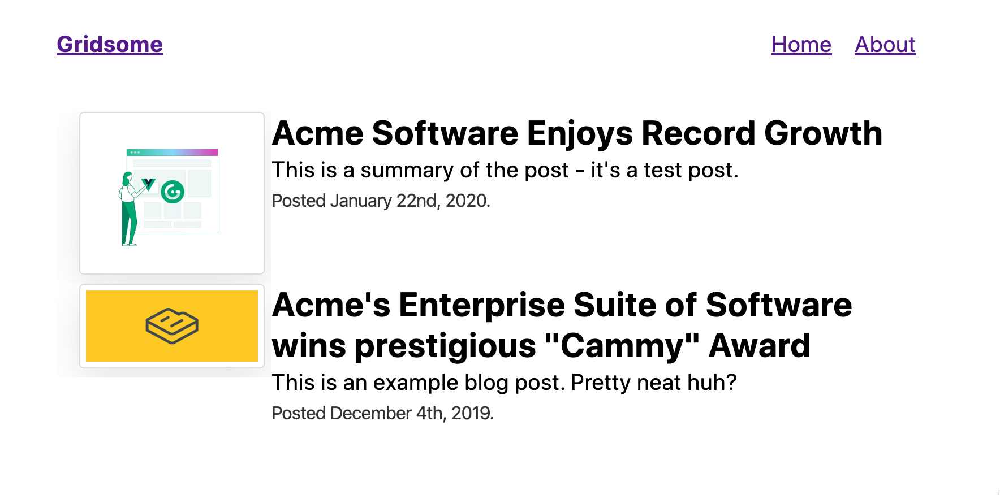
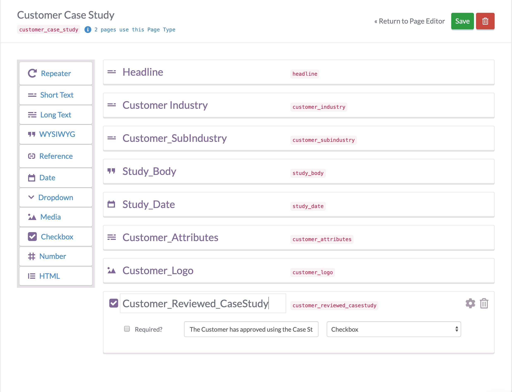
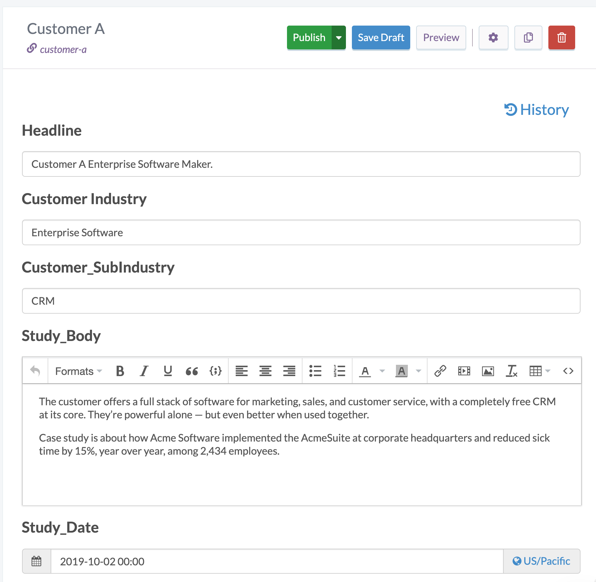
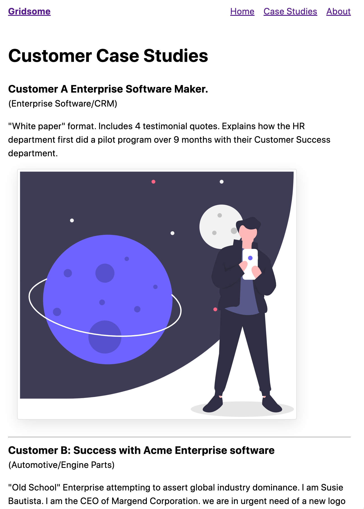

# @gridsome/buttercms

This is a guide to using ButterCMS in a gridsome project. It will walk you through what to add to a basic gridsome project to enable ButterCMS, how to add some content to display to ButterCMS, and what Vue components you’ll need to display that content.


## The TL;DR version:

Prepare to create a gridsome project:


    1.   ``npm install --global @gridsome/cli`` to update/install the gridsome CLI.
    2.   ``gridsome create <new_project_name>`` to create your gridsome project.
    3.   CD into the project and` `npm install gridsome-source-buttercms`` to install the ButterCMS gridsome npm module.
    4.   Let’s also include the npm modules for handling SCSS styling: ``npm install -D sass-loader node-sass``
    5. Create a free account on [ButterCMS](https://buttercms.com).
    6. Copy and save off your AuthToken from the welcome screen or Profile >> settings (it looks like this: a985f3f782f2115cd0f1b3ed12b52ec12295d6bb.
    7. Add a second Blog Post to your ButterCMS account by going to Blog Posts, then click the green “Write New Post” button at the top and write and Publish your post.
    8. Moving over to your project code, find your gridsome.config.js file and add to plugins: 

    ```
    {
        use: "gridsome-source-buttercms",
        options: {
          authToken: 'a985f3f782f2005...,<your AuthToken>',
          collections: [''],
          pages: '',
          pageTypes: ''
 	}
 	```

  9. Open `index.vue` in the pages folder (the default view) and make the changes described below in “Change pages/Index.vue”
  10.   Add a new vue component to the components folder, PostCard.vue, using the code below in “Add PostCard.vue” to components.
  11.    From your CLI, run `gridsome develop` and you should see two post summaries: the default ButterCMS post and your post.
  12.    Now, let’s add in access to our buttercms pageType, ‘customer_case_study’:
    -   Change gridsome.config.js from
        -   ``pageTypes: ''`` to
        -   ``pageTypes: 'customer_case_study'``
    -   Add a Studies.vue to Pages, to loop through <CaseStudy> items
    -   Add a CaseStudy.vue to Components that details an actual Case Study.
    -   Modify your `Default.vue` file in Layouts so you have a menuitem for Case Studies.


## Setup


### **Create a gridsome project**. 


1. Make sure your Gridsome CLI is up to date and installed: `npm install --global @gridsome/cli`

2. Now run this command to create a new project, substituting <new_project_name> with what your own choice of a new directory/project name:
    1. `gridsome create <new_project_name> `
    2. CD into that new directory: `cd <new_project_name>`
    3. And run `gridsome develop` to start local development.
    4. Your site is now running at `[http://localhost:8080/](http://localhost:8080/)` and that you can explore the GraphQL data at  `[http://localhost:8080/___explore](http://localhost:8080/___explore)` 
    5. Shut down gridsome with a `command-c`, and open this project in your code editor.


### Setting up your free ButterCMS account

So far, so good: now it’s time to set up your free butterCMS account, create some data so that your gridsome project can pull in that data.

Go to `[https://buttercms.com/](https://buttercms.com/)` and start your free account. After signing up (via google, GitHub or email/password), you see this screen:


Answer the questions, and next you’ll see ButterCMS’s start screen:





That long string is your API Token; you’ll need it to include in the butterCMS/gridsome configuration code.


### A bit about ButterCMS

Like our [docs](https://buttercms.com/docs/api-client/vuejs) say, ButterCMS is a headless CMS that lets you manage content using our dashboard and integrate it into your tech stack of choice with our content APIs.

That means you can create whatever content types your users need in ButterCMS and they can then use the ButterCMS’s dashboard to add/edit that content to their heart’s content. What kind of content?


*   Event Listings
*   SEO landing pages,
*   Customer Case Studies,
*   Company News & Updates,
*   Education Docs,
*   Location Pages,
*   Knowledgebases,
*   ...and anything else your users can dream up.

ButterCMS uses the idea of Pages as a way of organizing a given kind of data into whatever schema makes sense for you. In Pages, you can totally customize the structure and layout of a Page to match the data you want to hold. Clicking on a New Page starts the Page Editor, then you build out the page. Here’s what the Page Editor looks like as I set up a Page to hold data for Event Listings. 


<p id="gdcalert3" ><span style="color: red; font-weight: bold">>>>>>  gd2md-html alert: inline image link here (to images/full-gridsome2.png). Store image on your image server and adjust path/filename if necessary. </span><br>(<a href="#">Back to top</a>)(<a href="#gdcalert4">Next alert</a>)<br><span style="color: red; font-weight: bold">>>>>> </span></p>




So Pages let you predefine specific containers for specific kinds of data. To give you a headstart, and because the definition of a blog post is pretty well set, ButterCMS comes with one predefined Page: The BlogPost. 

In Blog Posts in ButterCMS, click the green “Write New Post” button, and create a blog post, just as someone in your company’s Marketing Department might. 

Here’s what that Blog Post looks like in ButterCMS:


### Create a blog post





Make sure to Publish it. You should now see it listed in Blog Posts:


So there are Blog Posts in ButterCMS. But there’s also - 


*   **Pages** - Like Blog Posts, but you define what you want for each page.
*   **Collections** - that typically hold small chunks of data., like detail rows in a table,
*   **Page Types** - Rather than having to define each Page before you use it, you can “promote” a given page to a “Page Type”. You can pick a particular Page Type from the New Page button to generate an instance of that Page Type, or filter just for that particular Page Type as you work with all pages.

To keep this guide straightforward, we will start by showing  a listing of your Blog Posts in Butter in our gridsome project, and then show how to add a custom Page - Meetups - to first ButterCMS and then include that Page in our Gridsome Project.


## Add code to your project

Next, you’ll configure a bit of code in your Gridsome project so that it can pull in your Blog posts from  ButterCMS. 


### Setting up your gridsome.config.js file with ButterCMS

The key bit of code is the config code that connects your project to gridsome via the npm "gridsome-source-buttercms" module. In your gridsome project, open the gridsome.config.js file.

Add a reference to the ButterCMS module you already installed in this project:

```
module.exports = {
  siteName: 'Gridsome',
  plugins: [{
    use: "gridsome-source-buttercms",
    options: {
      authToken: process.env.GRIDSOME_BUTTER_AUTHTOKEN  || process.env.BUTTER_AUTHTOKEN,
      collections: [''],
      pages: '',
      pageTypes: ''
    }
  }
  ]
}
```

Replace the AuthToken with your ButterCMS token. If you were putting this code into production, you’d leave this code as-is and add an environment variable named GRIDSOME_BUTTER_AUTHTOKEN. And Page Posts is baked into ButterCMS, so you don’t have to explicitly declare it in your gridsome.config.js file.

Your authToken is on the welcome screen of the dashboard and in your profile as ‘Write API Token’ and will look something like this: ‘a985f3f782f2125cd0f1b3ed12b52ec12295d6bb’

ButterCMS supports four ways you can organize and retrieve your data: Blog Posts, Collections, Pages and Page Types. We’ll start by connecting our Blog Posts to our Gridsome project.


### Adding a PostCard.vue component

Gridsome uses components to display data, so let’s add one to display a very basic Post listing.

In your components folder, create PostCard.vue with the following code:

```
<template>
  <div class="post-card__content-box">
    <div class="post-card__header">
      <g-image
        alt="Cover image"
        v-if="post.featured_image"
        class="post-card__image"
        :src="post.featured_image"
      />
    </div>
    <div class="post-card__content">
      <h2 class="post-card__title" v-html="post.title" />
      <p class="post-card__description" v-html="post.summary" />
      <PostMeta class="post-card__meta" :post="post" />
    </div>
  </div>
</template>

<script>
import PostMeta from "~/components/PostMeta";

export default {
  components: {
    PostMeta
  },
  props: ["post"]
};
</script>

<style lang="scss">
.post-card {
  margin-bottom: var(--space);
  position: relative;

  &__content-box {
    display: flex;
    flex-direction: row;
    align-items: flex-start;
  }

  &__header {
    margin-left: calc(var(--space) * -1);
    margin-right: calc(var(--space) * -1);
    margin-bottom: calc(var(--space) / 2);
    margin-top: calc(var(--space) * -1);
    overflow: hidden;
    border-radius: var(--radius) var(--radius) 0 0;
    flex-basis: 25%;
    &:empty {
      display: none;
    }
  }
  &__content {
    flex-basis: 75%;
  }
  &__image {
    border: 2px solid gray;
    width: 80%;
    margin-left: 20px;
    margin-right: auto;
    box-shadow: 1px 10px 30px 0 rgba(0, 0, 0, 0.1);
    border-radius: 8px;
    border: 1px solid #ddd;
    border-radius: 4px;
    padding: 5px;
    align-content: center;
  }
  &__title {
    margin-top: 0;
    margin-bottom: 0;
  }

  &__description {
    margin-top: 0;
    display: block;
    margin-block-start: 0em;
    margin-block-end: 0em;
    margin-inline-start: 0px;
    margin-inline-end: 0px;
  }

  &:hover {
    transform: translateY(-5px);
    box-shadow: 1px 10px 30px 0 rgba(0, 0, 0, 0.1);
  }

  &__tags {
    z-index: 1;
    position: relative;
  }

  &__link {
    position: absolute;
    top: 0;
    left: 0;
    width: 100%;
    height: 100%;
    opacity: 0;
    overflow: hidden;
    text-indent: -9999px;
    z-index: 0;
  }
}
</style>
```
A couple of things to note here;


*   We are referencing another Vue component - PostMeta - which we will build next.
*   We’ll passing in via props, “posts”
*   This is a styled component, using the BEM nomenclature.

Next, build another component (PostMeta.vue) in components with this code:


```
<template>
  <div class="post-meta">Posted {{ post.published }}.</div>
</template>

<script>
export default {
  props: ["post"]
};
</script>

<style>
.post-meta {
  font-size: 0.8em;
  opacity: 0.8;
}
</style>
```
Finally, we’ll use our PostCard component in Index.vue file in the Pages folder. Replace everything inside the <Layout> component with this code:

```
<template>
  <div class="post-meta">Posted {{ post.published }}.</div>
</template>

<script>
export default {
  props: ["post"]
};
</script>

<style>
.post-meta {
  font-size: 0.8em;
  opacity: 0.8;
}
</style>

```

Then add your GraphQL query:


```
<page-query>
query {
  posts: allButterPosts(order: ASC) {
    edges {
      node {
        id
        title
        url
        published  (format: "MMMM Do, YYYY")
        slug
        summary
        body
        featured_image
        tags {
          name
          slug
        }
      }
    }
  }
}
</page-query>

```

And finally, update your` <script>` and `<style>` tags:


```
<script>
import PostCard from "~/components/PostCard.vue";

export default {
  components: {
    PostCard
  },
  metaInfo: {
    title: "Hello, ButterCMS!"
  }
};
</script>

<style>
</style>
```

And that’s it! Restart your gridsome server by running `gridsome develop` and when you navigate to [http://localhost:8080](http://localhost:8080) you should see this:





### Adding Case Studies

Now all that is fine as far as serving the default blog posts from your ButterCMS account, but real world business needs are seldom that simple. Marketing comes to you, wanting to add ‘somehow’ their library of Customer Case Studies to the site. “That should take 5 minutes - they’re just like blog posts, but different!,” says the VP of Marketing to you. With ButterCMS and Gridsome, that statement actually be true.

Adding a new PageType to ButterCMS

First step is defining out a new PageType - Customer Case Study - in ButterCMS. This is what a [very basic] case study might look like:





Now you’ve got a framework for Case Studies, go ahead and populate a few in ButterCMS:





So you’ve got the data in ButterCMS. How do you get that data into Gridsome? 

The first step is exposing the PageType you want in your gridsome.config.js file by changing `pageTypes ‘ ‘` to `’pageTypes: ‘customer_case-study’`. This exposes your case study data inside your gridsome project. Since you want to query all of the customer case studies, you add the pageType: not specific pages to the line above.

Next, use the Gridsome’s GraphQL Explorer to discover the schema used for case studies. I checked out the Schema Tab in the tool and found `type ButterCustomerCaseStudy_Data` with the attribute names and types, then build a basic graphQL query to explore them:


Once you know the schema and have a query producing the data you want, the rest is straightforward: 


*   Create a Studies.vue file in the Pages Folder to hold your case studies, copy and pasting code from the Index.vue page where you list blog posts. Swap out the contents of the <page-query> tag for your case study query, modify your declaration for the <Study> component to fit, change the scoped css classes to suit.
*   Next create the CaseStudy.vue component in your Component folder. See the [repo](https://github.com/BobWalsh/butter-gridsome) for details.
*   Finally, reference the Studies.vue page in your layouts/Default.vue navbar so you have an easy way to get to the case studies page.
*   Now your ready for `gridsome develop` and see what you’ve built:





### A couple of final notes


1. You might think that you add `customer_case_study’ to the pages part of your gridsome.config.js. Nope. If you wanted to pull in just a specific page from ButterCMS, that’s what you would do, but for this post, we are going to expose all pages of the desired pageType, ‘customer_case_study’. 
2. If you’re a Gridsome/graphQL newbie like me, figuring out how to shape your GraphQL query is the hardest part of the journey. RTFM just a bit, specifically this doc on [Introspection](https://graphql.org/learn/introspection/) gives you a great starting point.
3. **Keep Calm and Code Along** - You’re trying to understand gridsome, graphQL, the data schema for your data in ButterCMS, how ButterCMS works, and how to code in Vue/gridsome, _all at the same time_! That’s why the The GraphQL explorer is great - you can focus on crafting your queries there.
4. Remember Gridsome builds static pages - when you change queries, page code and the like, expect to have to stop and restart Gridsome.

 

And that’s it! You’ve created a gridsome project, added ButterCMS to it, gotten a feel for what your users would see as they write posts and case studies and see how gridsome takes the data from ButterCMS and creates static content with it. Now, using the Gridsome/ButterCMS combo, you can have exactly the forms your business users need for their data, and output via gridsome that data as blazingly-fast Gridsome pages. 
